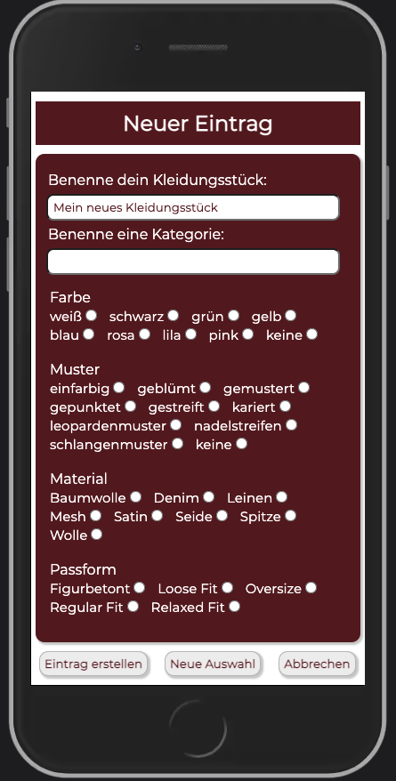

# Digitaler Kleiderschrank

This app helps you to remember what wonderful garments are hidden in your wardrobe.

This App is the capstone-project of my web development bootcamp @neuefische and is optimized for mobile usage only.

Stay tuned to see the development within the next weeks 💻

---

### Demo

[Have a look a Kleiderschrank on Vercel](http://capstone-project-liard-two.vercel.app/) 👀

---

### Screenshots

---

### Tech Stack

- React
- React Hooks
- PropTypes
- Styled Components
- Storybook
- React Testing Library
- localStorage
- npm
- Git Workflow
- Vercel
- Figma

---

### Project setup

- Clone this repository.
- Install all npm dependencies: `npm install`
- To run the app in development mode: `npm start`, then open [http://localhost:3000](http://localhost:3000) to view it in the browser
- To run Storybook: `npm run storybook`
- To run unit and component tests: `npm test`
- To create a build ready for deploying: `npm run build`

---

### Acknowledgements

Many thanks to my "Klammerfische"-Group, our great coaches and the neuefische team! Thank you for all the support, the wonderful team spirit and the unforgettable time with you.

---

### Catch me if you can

With many thanks to Lars for our own team logo 

Try to find it in our projects ^^
